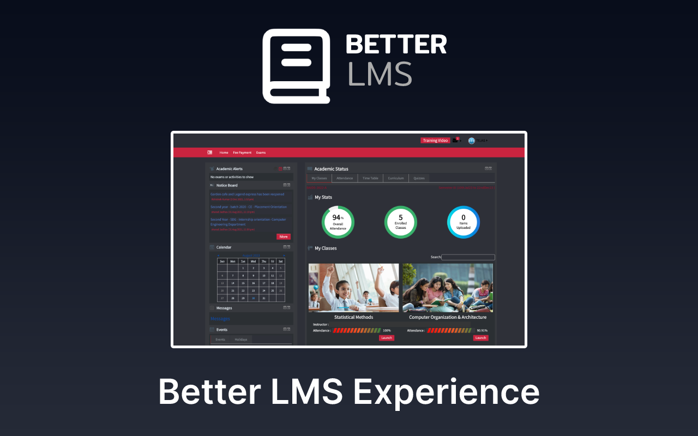
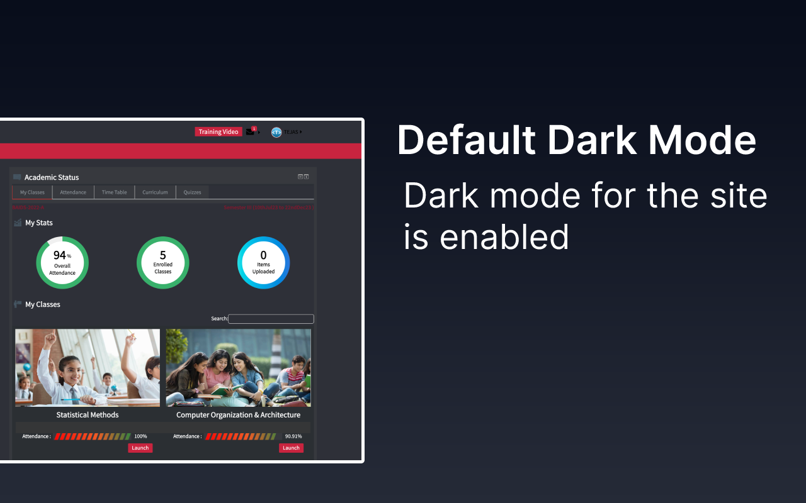
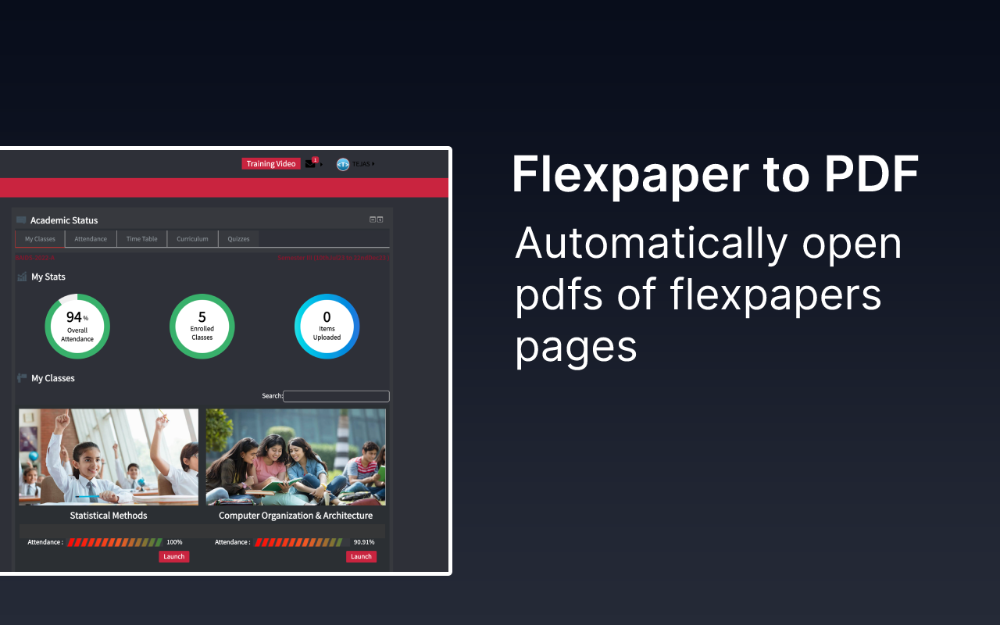

# 📝 BetterLMS

chrome extension that makes LMS experience better

## ⚒️ Features

- Dark mode for the site
- flexpaper links open pdfs in new tabs
- login page made minimal

This chrome extension is currently in development

## 🚀 Installation

1. Clone this repo to any folder on your device
2. Open Chrome, Settings>Extensions or go to `chrome://extensions`
3. enable developer mode
4. click on Load Unpacked and select your Unzipped folder.[select the directory which contains the `manifest.json` file]
5. Extension will be visible in extensions tab

## Plans
- upload on chrome webstore
- uploaded to mozilla [review pending]
- uploaded to opera store [review pending]

<!-- Add following script to JSON to compile to Mozilla add-on -->
<!--   // "browser_specific_settings": {
  //   "gecko": {
  //     "id": "betterlms@tejasbhovad.com",
  //     "strict_min_version": "42.0"
  //   }
  // }, -->
